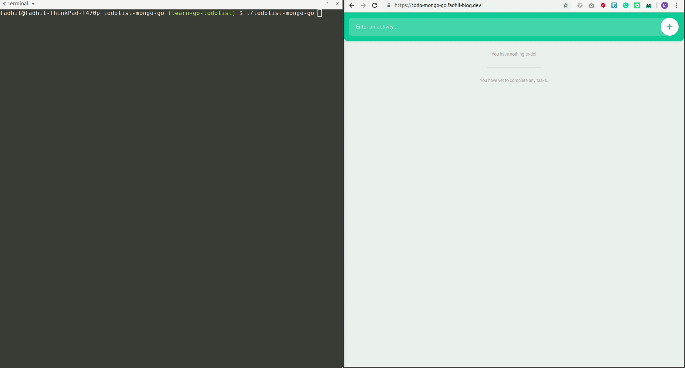

# Introduction
This is my effort to learn Go as my new second language. Initially I was following [this awesome tutorial](https://keiran.scot/building-a-todo-api-with-golang-and-kubernetes-part-1-introduction/) from Keiran Scot. However, I faced some problems with the front end that need fixing. The problems are:
- CORS-related
- Go imports

# Running the Demo

1. Run mongodb docker container with this command: `docker run --rm -it -v mongo:/data/db -p 27017:27017 mongo`
2. Run `./todolist-mongo-go` to bring up the server
3. Open `https://todo-mongo-go.fadhil-blog.dev/` on your browser

# What I have learned from this
- Basic Go program structures, including data structures in Go. Learned how to use maps & slices.
- How to connect Go to mongo (using mgo driver)
- How to write basic Go HTTP server using Gorilla Mux
- How to add CORS headers in Gorilla Mux

